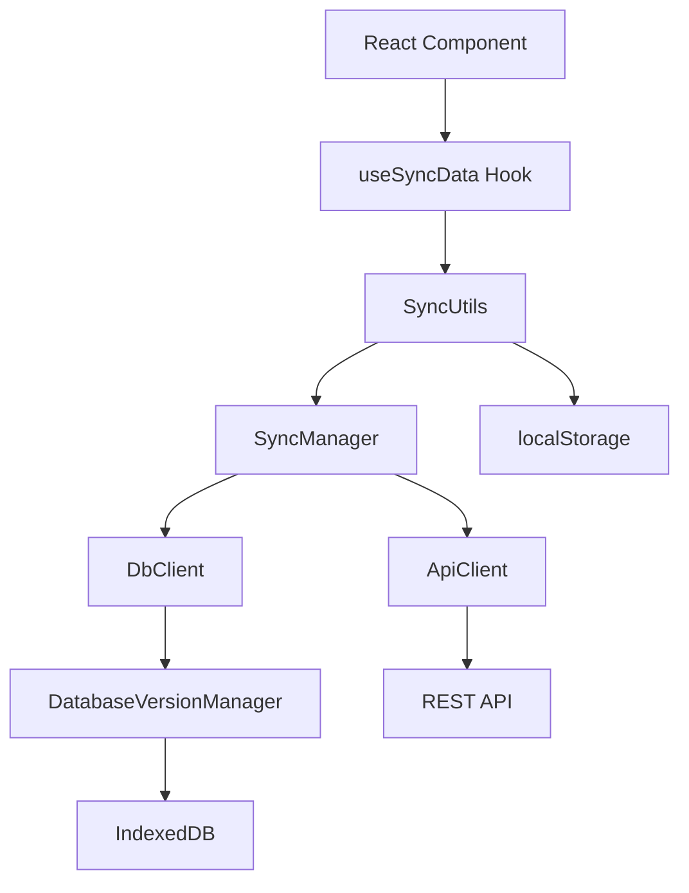

# 🔄 Система синхронизации IndexedDB

Универсальная система синхронизации данных между REST API сервером и локальной базой данных IndexedDB для React приложений с TypeScript.

## 📋 Содержание

- [Обзор системы](#-обзор-системы)
- [Архитектура](#️-архитектура)  
- [Установка и настройка](#️-установка-и-настройка)
- [Быстрый старт](#-быстрый-старт)
- [Структура файлов](#-структура-файлов)
- [Основные компоненты](#-основные-компоненты)
- [API документация](#-api-документация)
- [Примеры использования](#-примеры-использования)
- [Конфигурация](#️-конфигурация)
- [Troubleshooting](#-troubleshooting)
- [Производительность](#-производительность)
- [Тестирование](#-тестирование)

## 🎯 Обзор системы

Система обеспечивает автоматическую синхронизацию данных между REST API и локальной IndexedDB с поддержкой инкрементальных обновлений, offline-режима и конфликт-резолюции.

### ✨ Ключевые возможности

- 🔄 **Инкрементальная синхронизация** - загружает только изменённые данные
- 📊 **Версионирование таблиц** - отслеживает версии и время последней синхронизации
- 🎯 **Конфигурируемость** - работает с любыми таблицами через простую конфигурацию
- ⚡ **Высокая производительность** - эффективная работа с большими объёмами данных
- 🛡️ **TypeScript поддержка** - полная типизация для безопасности кода
- 🔧 **Глобальное управление версиями БД** - предотвращает конфликты между компонентами
- 📱 **Reactive UI** - автоматическое обновление интерфейса при изменении данных
- 🎨 **Готовые хуки** - простая интеграция в React компоненты

### 🏗️ Принципы работы

1. **Единая версия базы данных** - все компоненты используют один экземпляр IndexedDB
2. **Инкрементальные обновления** - синхронизируются только изменения с момента последней синхронизации
3. **Server-wins стратегия** - серверные данные имеют приоритет при конфликтах
4. **Event-driven архитектура** - уведомления о статусе через callback'и
5. **Конфигурация через код** - декларативное описание таблиц для синхронизации

## 🏛️ Архитектура

Система построена по принципу **Layered Architecture**:

```
┌─────────────────────────────────────────────────────────┐
│                    UI Layer                             │ ← React Components
├─────────────────────────────────────────────────────────┤
│                   Hooks Layer                           │ ← useSyncData, useIndexedDBData
├─────────────────────────────────────────────────────────┤
│                Business Logic Layer                     │ ← SyncUtils
├─────────────────────────────────────────────────────────┤
│                   Core Layer                            │ ← SyncManager, DbClient, ApiClient
├─────────────────────────────────────────────────────────┤
│                 Storage Layer                           │ ← IndexedDB, localStorage
└─────────────────────────────────────────────────────────┘
```

### 🔗 Компоненты и их взаимодействие



## ⚙️ Установка и настройка

### 1. Требования

- **React** 16.8+ (для хуков)
- **TypeScript** 4.0+
- **Современный браузер** с поддержкой IndexedDB
- **REST API** сервер с endpoints для синхронизации

### 2. Структура проекта

Добавьте следующие файлы в ваш проект:

```
src/
├── dataSync/                           # Ядро системы
│   ├── core/
│   │   ├── apiClient.ts               # HTTP клиент
│   │   ├── dbClient.ts                # IndexedDB клиент
│   │   └── syncManager.ts             # Менеджер синхронизации
│   ├── utils/
│   │   ├── syncUtils.ts               # Утилиты синхронизации
│   │   └── syncTypes.ts               # TypeScript типы
│   └── index.ts                       # Основной экспорт
└── hooks/
    ├── useSyncData.ts                 # Главный хук синхронизации
    └── useIndexedDBData.ts            # Хук для работы с одной таблицей
```

### 3. Настройка API сервера

Ваш сервер должен предоставлять следующие endpoints:

#### GET `/api/sync/table-versions`
Возвращает версии всех таблиц:
```json
{
  "success": true,
  "versions": {
    "users": "v1.2",
    "orders": "v1.5",
    "products": "v2.0"
  }
}
```

#### GET `/api/sync?tables=X&since=Y`
Возвращает изменения с определённого времени:
```json
{
  "success": true,
  "timestamp": "2025-06-04T12:00:00.000Z",
  "changes": {
    "users": {
      "inserted": [...],
      "updated": [...],
      "deleted": [...]
    }
  }
}
```

## 🚀 Быстрый старт

### Шаг 1: Создание конфигурации

```typescript
// config/syncConfig.ts
import { SyncConfig } from '../dataSync';

export const mySyncConfig: SyncConfig = {
  tables: ['users', 'orders', 'products'],
  apiBaseUrl: 'https://api.example.com',
  displayName: 'Основные данные',
  description: 'Пользователи, заказы и товары'
};
```

### Шаг 2: Использование в компоненте

```typescript
// components/UsersList.tsx
import React, { useEffect } from 'react';
import { useSyncData } from '../hooks/useSyncData';
import { mySyncConfig } from '../config/syncConfig';

const UsersList: React.FC = () => {
  const {
    tableData,
    isInitialized,
    isLoading,
    sync,
    error
  } = useSyncData(mySyncConfig, {
    autoInitialize: true,
    autoSync: true
  });

  const users = tableData?.users || [];

  if (!isInitialized) return <div>Инициализация...</div>;
  if (isLoading) return <div>Загрузка...</div>;
  if (error) return <div>Ошибка: {error}</div>;

  return (
    <div>
      <button onClick={sync}>Обновить</button>
      <ul>
        {users.map(user => (
          <li key={user.id}>{user.name}</li>
        ))}
      </ul>
    </div>
  );
};
```

### Шаг 3: Результат

- ✅ Автоматическая инициализация IndexedDB
- ✅ Синхронизация данных с сервера  
- ✅ Reactive обновление UI при изменении данных
- ✅ Автоматическая обработка ошибок

## 📁 Структура файлов

```
src/dataSync/
├── core/                              # Основные классы
│   ├── apiClient.ts                   # 🌐 HTTP клиент для API
│   ├── dbClient.ts                    # 💾 Клиент IndexedDB + глобальный менеджер версий
│   └── syncManager.ts                 # 🔄 Координатор синхронизации
├── utils/                             # Утилиты и типы
│   ├── syncUtils.ts                   # 🛠️ Бизнес-логика синхронизации
│   └── syncTypes.ts                   # 📝 TypeScript интерфейсы
└── index.ts                           # 📦 Главный экспорт API

src/hooks/
├── useSyncData.ts                     # ⚛️ Основной хук синхронизации
└── useIndexedDBData.ts                # 📊 Упрощенный хук для одной таблицы
```

## 🧩 Основные компоненты

### 1. 🏗️ Core Layer

#### `DatabaseVersionManager` (Singleton)
Глобальный менеджер версий базы данных, предотвращает конфликты между компонентами:

```typescript
class DatabaseVersionManager {
  static getInstance(): DatabaseVersionManager
  async ensureDatabase(requiredTables: string[]): Promise<IDBDatabase>
  close(): void
  reset(): void
}
```

**Ключевые особенности:**
- 🔒 **Singleton паттерн** - один экземпляр на все приложение
- 🔄 **Переиспользование соединений** - избегает конфликтов версий
- 🛡️ **Автоматическое управление схемой** - создает отсутствующие таблицы

#### `DbClient`
Обертка над IndexedDB для удобной работы с данными:

```typescript
class DbClient {
  async init(tables: string[]): Promise<void>
  async getTable(tableName: string): Promise<any[]>
  async putAll(tableName: string, records: any[]): Promise<void>
  async deleteRecord(tableName: string, key: number): Promise<void>
}
```

#### `ApiClient`
HTTP клиент для взаимодействия с сервером:

```typescript
class ApiClient {
  async getTableData(tableName: string, lastSync: string): Promise<any[]>
  async getTableVersion(tableName: string): Promise<string>
}
```

#### `SyncManager`
Координирует процесс синхронизации:

```typescript
class SyncManager {
  async init(): Promise<void>
  async sync(): Promise<void>
  async getTableData(tableName: string): Promise<any[]>
}
```

### 2. 🛠️ Utils Layer

#### `SyncUtils`
Бизнес-логика синхронизации с event-driven архитектурой:

```typescript
class SyncUtils {
  async initialize(): Promise<boolean>
  async sync(): Promise<SyncResult>
  async resetDatabase(): Promise<void>
  setEventCallback(callback: SyncEventCallback): void
  async getTableData(tableName: string): Promise<any[]>
}
```

**Возможности:**
- 📡 **Event callbacks** - уведомления о статусе синхронизации
- 🔄 **Инкрементальная синхронизация** - только изменённые данные
- ⚡ **Пакетная обработка** - эффективная загрузка больших объемов
- 🔍 **Автоматическое определение стратегии** - полная/инкрементальная синхронизация

### 3. ⚛️ Hooks Layer

#### `useSyncData` - Основной хук
Предоставляет полный API для работы с синхронизацией:

```typescript
const {
  // Состояние
  isInitialized,
  isLoading,
  error,
  
  // Данные
  tableData,
  syncStatuses,
  lastSyncResult,
  
  // Методы
  sync,
  loadTableData,
  resetDatabase,
  
  // Утилиты
  getSyncMetrics,
  isDataFresh,
  needsSync
} = useSyncData(config, options);
```

#### `useIndexedDBData` - Упрощенный хук
Для работы с одной таблицей:

```typescript
const {
  data,
  isLoading,
  error,
  refresh,
  sync
} = useIndexedDBData('tableName', config);
```

## 📚 API документация

### Типы данных

#### `SyncConfig`
Конфигурация синхронизации:
```typescript
interface SyncConfig {
  tables: string[];              // Список таблиц для синхронизации
  apiBaseUrl?: string;           // URL API сервера
  displayName?: string;          // Человекочитаемое имя
  description?: string;          // Описание назначения
}
```

#### `SyncStatus`
Статус синхронизации таблицы:
```typescript
interface SyncStatus {
  table: string;                 // Имя таблицы
  status: 'idle' | 'checking' | 'syncing' | 'success' | 'error';
  message: string;               // Описание состояния
  localVersion?: string;         // Локальная версия
  serverVersion?: string;        // Серверная версия
}
```

#### `SyncResult`
Результат операции синхронизации:
```typescript
interface SyncResult {
  success: boolean;              // Успешность операции
  results: TableSyncResult[];    // Результаты по каждой таблице
  totalTime: number;             // Время выполнения (мс)
  timestamp: string;             // Время завершения (ISO)
}
```

#### `TableSyncResult`
Детальный результат синхронизации таблицы:
```typescript
interface TableSyncResult {
  table: string;                 // Имя таблицы
  success: boolean;              // Успешность операции
  recordsInserted: number;       // Количество добавленных записей
  recordsUpdated: number;        // Количество обновленных записей
  recordsDeleted: number;        // Количество удаленных записей
  error?: string;                // Текст ошибки (если есть)
}
```

### Опции хука `useSyncData`

```typescript
interface UseSyncDataOptions {
  autoInitialize?: boolean;      // Автоматическая инициализация (default: true)
  autoSync?: boolean;            // Автоматическая синхронизация (default: false)
  syncInterval?: number;         // Интервал автосинхронизации в минутах
  maxRetries?: number;           // Максимальное количество повторов (default: 3)
  retryDelay?: number;           // Задержка между повторами в мс (default: 1000)
}
```

### Методы хука `useSyncData`

#### Управление данными
```typescript
// Принудительная синхронизация всех таблиц
const result = await sync();

// Загрузка данных конкретной таблицы из IndexedDB
const users = await loadTableData('users');

// Загрузка всех таблиц
const allData = await loadAllData();

// Получение данных из текущего состояния
const users = getTableDataFromState('users');
```

#### Управление системой
```typescript
// Ручная инициализация (если autoInitialize: false)
const success = await initialize();

// Полный сброс локальной базы данных
await resetDatabase();

// Очистка ошибок
clearError();
```

#### Проверка состояния
```typescript
// Проверка актуальности данных (в минутах)
const isFresh = isDataFresh('users', 30);

// Нужна ли синхронизация
const needsUpdate = needsSync(60);

// Получение метрик синхронизации
const metrics = getSyncMetrics();

// Статус конкретной таблицы
const status = getSyncStatus('users');
```

## 💡 Примеры использования

### 1. Базовый список с автосинхронизацией

```typescript
// components/ProductList.tsx
import React from 'react';
import { useSyncData } from '../hooks/useSyncData';
import { productSyncConfig } from '../config/syncConfig';

const ProductList: React.FC = () => {
  const {
    tableData,
    isLoading,
    error,
    sync,
    isDataFresh,
    lastSyncResult
  } = useSyncData(productSyncConfig, {
    autoInitialize: true,
    autoSync: true,
    syncInterval: 15 // каждые 15 минут
  });

  const products = tableData?.products || [];

  return (
    <div className="product-list">
      <div className="header">
        <h2>Товары ({products.length})</h2>
        <button 
          onClick={sync} 
          disabled={isLoading}
          className={!isDataFresh('products', 30) ? 'btn-warning' : 'btn-primary'}
        >
          {isLoading ? 'Синхронизация...' : 'Обновить'}
        </button>
      </div>

      {error && (
        <div className="alert alert-error">
          Ошибка: {error}
        </div>
      )}

      {lastSyncResult && (
        <div className="sync-info">
          Последняя синхронизация: {new Date(lastSyncResult.timestamp).toLocaleString()}
          {!lastSyncResult.success && <span className="error"> (с ошибками)</span>}
        </div>
      )}

      <div className="product-grid">
        {products.map(product => (
          <div key={product.id} className="product-card">
            <h3>{product.name}</h3>
            <p>{product.description}</p>
            <div className="price">{product.price} ₽</div>
          </div>
        ))}
      </div>
    </div>
  );
};
```

### 2. Мастер-детальная страница

```typescript
// components/OrderMasterDetail.tsx
import React, { useState } from 'react';
import { useSyncData } from '../hooks/useSyncData';
import { orderSyncConfig } from '../config/syncConfig';

const OrderMasterDetail: React.FC = () => {
  const [selectedOrderId, setSelectedOrderId] = useState<number | null>(null);
  
  const {
    tableData,
    loadTableData,
    isLoading
  } = useSyncData(orderSyncConfig);

  const orders = tableData?.orders || [];
  const orderItems = tableData?.order_items || [];
  const customers = tableData?.customers || [];

  const selectedOrder = orders.find(o => o.id === selectedOrderId);
  const selectedOrderItems = orderItems.filter(item => item.order_id === selectedOrderId);
  const customer = customers.find(c => c.id === selectedOrder?.customer_id);

  const handleOrderClick = async (orderId: number) => {
    setSelectedOrderId(orderId);
    
    // Загружаем связанные данные при необходимости
    if (orderItems.length === 0) {
      await loadTableData('order_items');
    }
  };

  return (
    <div className="order-master-detail">
      <div className="master-panel">
        <h2>Заказы</h2>
        {isLoading && <div className="spinner">Загрузка...</div>}
        
        <div className="order-list">
          {orders.map(order => (
            <div 
              key={order.id}
              className={`order-item ${selectedOrderId === order.id ? 'selected' : ''}`}
              onClick={() => handleOrderClick(order.id)}
            >
              <div className="order-number">#{order.number}</div>
              <div className="order-date">{new Date(order.created_at).toLocaleDateString()}</div>
              <div className="order-amount">{order.total_amount} ₽</div>
            </div>
          ))}
        </div>
      </div>

      <div className="detail-panel">
        {selectedOrder ? (
          <div className="order-details">
            <h3>Заказ #{selectedOrder.number}</h3>
            
            <div className="customer-info">
              <h4>Клиент</h4>
              <p>{customer?.name || 'Не найден'}</p>
            </div>

            <div className="order-items">
              <h4>Товары</h4>
              {selectedOrderItems.map(item => (
                <div key={item.id} className="order-item-row">
                  <span>{item.product_name}</span>
                  <span>{item.quantity} шт.</span>
                  <span>{item.price} ₽</span>
                </div>
              ))}
            </div>

            <div className="order-total">
              <strong>Итого: {selectedOrder.total_amount} ₽</strong>
            </div>
          </div>
        ) : (
          <div className="no-selection">
            Выберите заказ для просмотра деталей
          </div>
        )}
      </div>
    </div>
  );
};
```

### 3. Offline-ready приложение

```typescript
// components/OfflineApp.tsx
import React, { useEffect, useState } from 'react';
import { useSyncData } from '../hooks/useSyncData';
import { appSyncConfig } from '../config/syncConfig';

const OfflineApp: React.FC = () => {
  const [isOnline, setIsOnline] = useState(navigator.onLine);
  const [pendingChanges, setPendingChanges] = useState([]);

  const {
    tableData,
    sync,
    isLoading,
    error,
    lastSyncResult,
    needsSync
  } = useSyncData(appSyncConfig);

  // Отслеживаем статус сети
  useEffect(() => {
    const handleOnline = () => setIsOnline(true);
    const handleOffline = () => setIsOnline(false);

    window.addEventListener('online', handleOnline);
    window.addEventListener('offline', handleOffline);

    return () => {
      window.removeEventListener('online', handleOnline);
      window.removeEventListener('offline', handleOffline);
    };
  }, []);

  // Автоматическая синхронизация при восстановлении сети
  useEffect(() => {
    if (isOnline && needsSync(5)) {
      console.log('🌐 Сеть восстановлена, синхронизируем данные...');
      sync();
    }
  }, [isOnline, sync, needsSync]);

  const handleCreateRecord = async (data: any) => {
    if (isOnline) {
      // Создаем на сервере и синхронизируем
      await createOnServer(data);
      await sync();
    } else {
      // Сохраняем локально для последующей синхронизации
      const pendingChange = {
        id: Date.now(),
        operation: 'create',
        table: 'records',
        data,
        timestamp: new Date().toISOString()
      };
      
      setPendingChanges(prev => [...prev, pendingChange]);
      console.log('📱 Данные сохранены локально для последующей синхронизации');
    }
  };

  const syncPendingChanges = async () => {
    if (!isOnline || pendingChanges.length === 0) return;

    for (const change of pendingChanges) {
      try {
        await applyChangeOnServer(change);
        setPendingChanges(prev => prev.filter(c => c.id !== change.id));
      } catch (error) {
        console.error('Ошибка применения изменения:', error);
      }
    }

    await sync();
  };

  return (
    <div className="offline-app">
      {/* Индикатор состояния сети */}
      <div className={`network-status ${isOnline ? 'online' : 'offline'}`}>
        <span className="status-icon">
          {isOnline ? '🌐' : '📱'}
        </span>
        <span className="status-text">
          {isOnline ? 'Онлайн' : 'Офлайн режим'}
        </span>
        
        {pendingChanges.length > 0 && (
          <span className="pending-changes">
            {pendingChanges.length} изменений ожидают синхронизации
          </span>
        )}
      </div>

      {/* Кнопки управления */}
      <div className="controls">
        <button onClick={sync} disabled={!isOnline || isLoading}>
          {isLoading ? 'Синхронизация...' : 'Синхронизировать'}
        </button>
        
        {pendingChanges.length > 0 && isOnline && (
          <button onClick={syncPendingChanges} className="btn-warning">
            Применить локальные изменения ({pendingChanges.length})
          </button>
        )}
      </div>

      {/* Информация о последней синхронизации */}
      {lastSyncResult && (
        <div className="sync-info">
          <small>
            Последняя синхронизация: {new Date(lastSyncResult.timestamp).toLocaleString()}
            {lastSyncResult.success ? ' ✅' : ' ❌'}
          </small>
        </div>
      )}

      {error && (
        <div className="alert alert-error">
          {error}
        </div>
      )}

      {/* Основной контент приложения */}
      <div className="app-content">
        {/* Ваш контент здесь */}
      </div>
    </div>
  );
};
```

### 4. Мониторинг синхронизации

```typescript
// components/SyncMonitor.tsx
import React from 'react';
import { useSyncData } from '../hooks/useSyncData';
import { monitorConfig } from '../config/syncConfig';

const SyncMonitor: React.FC = () => {
  const {
    syncStatuses,
    lastSyncResult,
    getSyncMetrics,
    isLoading,
    resetDatabase
  } = useSyncData(monitorConfig);

  const metrics = getSyncMetrics();

  const getStatusIcon = (status: string) => {
    switch (status) {
      case 'success': return '✅';
      case 'error': return '❌';
      case 'syncing': return '🔄';
      case 'checking': return '🔍';
      default: return '⏸️';
    }
  };

  const getStatusClass = (status: string) => {
    switch (status) {
      case 'success': return 'status-success';
      case 'error': return 'status-error';
      case 'syncing': return 'status-syncing';
      case 'checking': return 'status-checking';
      default: return 'status-idle';
    }
  };

  return (
    <div className="sync-monitor">
      <div className="monitor-header">
        <h3>Мониторинг синхронизации</h3>
        <button 
          onClick={resetDatabase}
          className="btn-danger btn-sm"
          title="Полная очистка локальной базы"
        >
          Сбросить БД
        </button>
      </div>

      {/* Общие метрики */}
      <div className="sync-metrics">
        <div className="metric">
          <span className="metric-label">Всего таблиц:</span>
          <span className="metric-value">{metrics.totalTables}</span>
        </div>
        <div className="metric">
          <span className="metric-label">Успешно:</span>
          <span className="metric-value text-success">{metrics.successfulTables}</span>
        </div>
        <div className="metric">
          <span className="metric-label">С ошибками:</span>
          <span className="metric-value text-error">{metrics.failedTables}</span>
        </div>
        <div className="metric">
          <span className="metric-label">Обработано записей:</span>
          <span className="metric-value">{metrics.totalRecordsProcessed}</span>
        </div>
      </div>

      {/* Статусы таблиц */}
      <div className="table-statuses">
        <h4>Статус таблиц</h4>
        {syncStatuses.map(status => (
          <div key={status.table} className={`table-status ${getStatusClass(status.status)}`}>
            <div className="status-header">
              <span className="status-icon">{getStatusIcon(status.status)}</span>
              <span className="table-name">{status.table}</span>
              <span className="status-badge">{status.status}</span>
            </div>
            
            <div className="status-message">
              {status.message}
            </div>
            
            {status.localVersion && status.serverVersion && (
              <div className="version-info">
                <small>
                  Локальная: {status.localVersion} | 
                  Серверная: {status.serverVersion}
                </small>
              </div>
            )}
          </div>
        ))}
      </div>

      {/* Результат последней синхронизации */}
      {lastSyncResult && (
        <div className="last-sync-result">
          <h4>Последняя синхронизация</h4>
          <div className={`sync-summary ${lastSyncResult.success ? 'success' : 'error'}`}>
            <div className="summary-header">
              <span>{lastSyncResult.success ? '✅' : '❌'} Статус: {lastSyncResult.success ? 'Успешно' : 'С ошибками'}</span>
              <span>⏱️ Время: {lastSyncResult.totalTime}мс</span>
              <span>🕐 {new Date(lastSyncResult.timestamp).toLocaleString()}</span>
            </div>
            
            <div className="sync-details">
              {lastSyncResult.results.map(result => (
                <div key={result.table} className="table-result">
                  <strong>{result.table}:</strong>
                  {result.success ? (
                    <span className="text-success">
                      +{result.recordsInserted} ~{result.recordsUpdated} -{result.recordsDeleted}
                    </span>
                  ) : (
                    <span className="text-error">{result.error}</span>
                  )}
                </div>
              ))}
            </div>
          </div>
        </div>
      )}

      {isLoading && (
        <div className="loading-overlay">
          <div className="spinner"></div>
          <span>Синхронизация в процессе...</span>
        </div>
      )}
    </div>
  );
};
```

## ⚙️ Конфигурация

### Создание конфигурации синхронизации

```typescript
// config/syncConfig.ts
import { SyncConfig } from '../dataSync';

// Базовая конфигурация
export const basicSyncConfig: SyncConfig = {
  tables: ['users', 'orders'],
  apiBaseUrl: 'https://api.example.com'
};

// Расширенная конфигурация
export const advancedSyncConfig: SyncConfig = {
  tables: [
    'reference_products',
    'reference_categories', 
    'reference_suppliers',
    'link_product_categories',
    'transactions'
  ],
  apiBaseUrl: process.env.REACT_APP_API_URL || 'http://localhost:3000',
  displayName: 'Система управления товарами',
  description: 'Справочники товаров, категорий, поставщиков и транзакции'
};

// Конфигурация для разных окружений
export const createSyncConfig = (environment: 'development' | 'production'): SyncConfig => ({
  tables: ['users', 'settings', 'data'],
  apiBaseUrl: environment === 'production' 
    ? 'https://api.mycompany.com'
    : 'http://localhost:3000',
  displayName: `Приложение (${environment})`,
  description: `Конфигурация для ${environment} окружения`
});
```

### Фабричные функции

```typescript
// utils/configFactory.ts
import { SyncConfig } from '../dataSync';

export const createModuleSyncConfig = (
  moduleName: string,
  tables: string[],
  baseUrl?: string
): SyncConfig => ({
  tables,
  apiBaseUrl: baseUrl || process.env.REACT_APP_API_URL || 'http://localhost:3000',
  displayName: `Модуль: ${moduleName}`,
  description: `Синхронизация данных модуля ${moduleName}`
});

// Использование
export const userModuleConfig = createModuleSyncConfig(
  'Пользователи',
  ['users', 'user_roles', 'permissions']
);

export const inventoryModuleConfig = createModuleSyncConfig(
  'Склад',
  ['products', 'categories', 'stock_movements']
);
```

### Продвинутые опции

```typescript
// hooks/useAdvancedSync.ts
import { useSyncData } from './useSyncData';
import { SyncConfig } from '../dataSync';

interface AdvancedSyncOptions {
  enableOfflineMode?: boolean;
  syncOnFocus?: boolean;
  syncOnNetworkRestore?: boolean;
  maxCacheAge?: number; // минуты
}

export const useAdvancedSync = (
  config: SyncConfig, 
  options: AdvancedSyncOptions = {}
) => {
  const {
    enableOfflineMode = true,
    syncOnFocus = true,
    syncOnNetworkRestore = true,
    maxCacheAge = 60
  } = options;

  const syncData = useSyncData(config, {
    autoInitialize: true,
    autoSync: false
  });

  // Синхронизация при фокусе окна
  useEffect(() => {
    if (!syncOnFocus) return;

    const handleFocus = () => {
      if (syncData.needsSync(maxCacheAge)) {
        console.log('🔄 Окно получило фокус, синхронизируем устаревшие данные...');
        syncData.sync();
      }
    };

    window.addEventListener('focus', handleFocus);
    return () => window.removeEventListener('focus', handleFocus);
  }, [syncOnFocus, maxCacheAge, syncData]);

  // Синхронизация при восстановлении сети
  useEffect(() => {
    if (!syncOnNetworkRestore) return;

    const handleOnline = () => {
      console.log('🌐 Сеть восстановлена, синхронизируем данные...');
      syncData.sync();
    };

    window.addEventListener('online', handleOnline);
    return () => window.removeEventListener('online', handleOnline);
  }, [syncOnNetworkRestore, syncData]);

  return {
    ...syncData,
    isOfflineMode: enableOfflineMode && !navigator.onLine
  };
};
```

## 🔧 Troubleshooting

### Распространенные проблемы

#### 1. "Database not initialized" 
```
❌ Ошибка: Database not initialized. Please call init() first.
```

**Причина:** Обращение к методам до инициализации базы данных.

**Решение:**
```typescript
const { isInitialized, loadTableData } = useSyncData(config);

// ❌ Неправильно
useEffect(() => {
  loadTableData('users'); // может вызваться до инициализации
}, []);

// ✅ Правильно
useEffect(() => {
  if (isInitialized) {
    loadTableData('users');
  }
}, [isInitialized]);
```

#### 2. Конфликт версий IndexedDB
```
⚠️ DatabaseVersionManager: Открытие БД заблокировано
```

**Причина:** Несколько вкладок пытаются обновить схему БД одновременно.

**Решение:**
```typescript
// Закройте все вкладки с приложением и перезагрузите страницу
// Или используйте утилиту сброса:

import { clearDatabase } from '../dataSync';

const resetDb = async () => {
  await clearDatabase();
  window.location.reload();
};
```

#### 3. Отсутствующие таблицы в конфигурации
```
❌ Данные банков не загружены
📊 banksData на старте: 0 []
```

**Причина:** Таблица не указана в `tables` массиве конфигурации.

**Решение:**
```typescript
// ❌ Неполная конфигурация
const config: SyncConfig = {
  tables: ['users', 'orders'] // отсутствует 'banks'
};

// ✅ Полная конфигурация
const config: SyncConfig = {
  tables: ['users', 'orders', 'banks'] // все нужные таблицы
};
```

#### 4. Бесконечный цикл синхронизации
```
🔄 useSyncData: Вызываем syncUtils.initialize()...
🔄 useSyncData: Вызываем syncUtils.initialize()...
```

**Причина:** Зависимости в `useEffect` включают функции, которые пересоздаются.

**Решение:**
```typescript
// ❌ Неправильно - loadData в зависимостях
useEffect(() => {
  if (isInitialized) {
    loadData();
  }
}, [isInitialized, loadData]); // loadData пересоздается

// ✅ Правильно - используем флаг
const [dataLoaded, setDataLoaded] = useState(false);

useEffect(() => {
  if (isInitialized && !dataLoaded) {
    loadData().then(() => setDataLoaded(true));
  }
}, [isInitialized, dataLoaded]);
```

#### 5. Данные не обновляются после синхронизации
```
✅ Синхронизация завершена успешно
📊 tableData по-прежнему пустой
```

**Причина:** Состояние не обновляется после синхронизации.

**Решение:**
```typescript
const { tableData, lastSyncResult } = useSyncData(config);

// Принудительная перезагрузка после синхронизации
useEffect(() => {
  if (lastSyncResult?.success) {
    // Данные должны обновиться автоматически
    // Если нет - проверьте реализацию useSyncData
  }
}, [lastSyncResult]);
```

### Отладка

#### Включение детального логирования
```typescript
// В localStorage
localStorage.setItem('sync_debug', 'true');

// Или в коде
console.log('🔍 Debug режим активирован');
```

#### Мониторинг производительности
```typescript
const { getSyncMetrics } = useSyncData(config);

useEffect(() => {
  const metrics = getSyncMetrics();
  console.log('📊 Метрики синхронизации:', {
    totalTables: metrics.totalTables,
    syncDuration: metrics.syncDuration,
    totalRecords: metrics.totalRecordsProcessed,
    lastSync: metrics.lastSyncTime
  });
}, [getSyncMetrics]);
```

#### Проверка состояния IndexedDB
```typescript
// Утилита для проверки содержимого БД
const inspectDatabase = async () => {
  const { loadTableData } = useSyncData(config);
  
  const tables = ['users', 'orders', 'products'];
  for (const table of tables) {
    try {
      const data = await loadTableData(table);
      console.log(`📊 ${table}:`, data.length, 'записей');
      console.log('📝 Первая запись:', data[0]);
    } catch (error) {
      console.error(`❌ Ошибка загрузки ${table}:`, error);
    }
  }
};
```

## 📈 Производительность

### Оптимизация больших объемов данных

#### Пакетная обработка
```typescript
// В SyncUtils - автоматическая пакетная обработка
const BATCH_SIZE = 1000;

const processBatches = async (records: any[], tableName: string) => {
  for (let i = 0; i < records.length; i += BATCH_SIZE) {
    const batch = records.slice(i, i + BATCH_SIZE);
    await this.syncManager.db.putAll(tableName, batch);
    
    // Даем браузеру передохнуть
    await new Promise(resolve => setTimeout(resolve, 0));
    
    console.log(`📊 Обработано ${i + batch.length}/${records.length} записей`);
  }
};
```

#### Lazy Loading таблиц
```typescript
const useLazyTableData = (tableName: string, config: SyncConfig) => {
  const [data, setData] = useState<any[]>([]);
  const [loaded, setLoaded] = useState(false);
  
  const { loadTableData, isInitialized } = useSyncData(config);

  const loadData = useCallback(async () => {
    if (!loaded && isInitialized) {
      console.log(`📥 Lazy loading: ${tableName}`);
      const tableData = await loadTableData(tableName);
      setData(tableData);
      setLoaded(true);
    }
  }, [loaded, isInitialized, tableName, loadTableData]);

  return { data, loadData, loaded };
};

// Использование
const OrderDetails: React.FC<{ orderId: number }> = ({ orderId }) => {
  const { data: orderItems, loadData } = useLazyTableData('order_items', config);
  
  useEffect(() => {
    if (orderId) {
      loadData(); // Загружаем только при необходимости
    }
  }, [orderId, loadData]);

  const items = orderItems.filter(item => item.order_id === orderId);
  return <div>{/* Рендеринг элементов */}</div>;
};
```

#### Индексирование для быстрого поиска
```typescript
// Расширение DbClient для создания индексов
export class EnhancedDbClient extends DbClient {
  async createIndexes(tableName: string, indexes: string[]): Promise<void> {
    // Создание составных индексов при инициализации
    const transaction = this.db!.transaction([tableName], 'readwrite');
    const store = transaction.objectStore(tableName);
    
    indexes.forEach(indexName => {
      if (!store.indexNames.contains(indexName)) {
        store.createIndex(indexName, indexName, { unique: false });
      }
    });
  }

  async findByIndex(tableName: string, indexName: string, value: any): Promise<any[]> {
    return new Promise((resolve, reject) => {
      const transaction = this.db!.transaction([tableName], 'readonly');
      const store = transaction.objectStore(tableName);
      const index = store.index(indexName);
      const request = index.getAll(value);
      
      request.onsuccess = () => resolve(request.result);
      request.onerror = () => reject(request.error);
    });
  }
}
```

#### Мемоизация вычислений
```typescript
import { useMemo } from 'react';

const ProductList: React.FC = () => {
  const { tableData } = useSyncData(config);
  
  // Мемоизация тяжелых вычислений
  const processedProducts = useMemo(() => {
    const products = tableData?.products || [];
    const categories = tableData?.categories || [];
    
    return products.map(product => ({
      ...product,
      category: categories.find(c => c.id === product.category_id),
      priceFormatted: new Intl.NumberFormat('ru-RU', {
        style: 'currency',
        currency: 'RUB'
      }).format(product.price)
    }));
  }, [tableData?.products, tableData?.categories]);

  return (
    <div>
      {processedProducts.map(product => (
        <ProductCard key={product.id} product={product} />
      ))}
    </div>
  );
};
```

### Мониторинг производительности

```typescript
// utils/performanceMonitor.ts
export class PerformanceMonitor {
  private static metrics = new Map<string, number>();

  static startTiming(label: string): void {
    this.metrics.set(label, performance.now());
  }

  static endTiming(label: string): number {
    const start = this.metrics.get(label);
    if (!start) return 0;
    
    const duration = performance.now() - start;
    this.metrics.delete(label);
    
    console.log(`⏱️ ${label}: ${duration.toFixed(2)}ms`);
    return duration;
  }

  static async measureAsync<T>(label: string, fn: () => Promise<T>): Promise<T> {
    this.startTiming(label);
    try {
      const result = await fn();
      this.endTiming(label);
      return result;
    } catch (error) {
      this.endTiming(label);
      throw error;
    }
  }
}

// Использование
const { sync } = useSyncData(config);

const handleSync = async () => {
  await PerformanceMonitor.measureAsync('Full Sync', async () => {
    await sync();
  });
};
```

## 🧪 Тестирование

### Unit тесты для сервисов

```typescript
// __tests__/syncUtils.test.ts
import { SyncUtils } from '../dataSync/utils/syncUtils';
import { MockApiClient } from './mocks/MockApiClient';

describe('SyncUtils', () => {
  let syncUtils: SyncUtils;
  let mockApi: MockApiClient;

  beforeEach(() => {
    mockApi = new MockApiClient();
    syncUtils = new SyncUtils(['users'], 'http://localhost:3000');
  });

  it('должен корректно инициализироваться', async () => {
    const result = await syncUtils.initialize();
    expect(result).toBe(true);
  });

  it('должен синхронизировать новые данные', async () => {
    mockApi.setTableData('users', [
      { id: 1, name: 'John', email: 'john@test.com' }
    ]);

    await syncUtils.initialize();
    const result = await syncUtils.sync();

    expect(result.success).toBe(true);
    expect(result.results).toHaveLength(1);
    expect(result.results[0].recordsInserted).toBe(1);
  });

  it('должен обрабатывать ошибки сети', async () => {
    mockApi.simulateNetworkError();

    await syncUtils.initialize();
    const result = await syncUtils.sync();

    expect(result.success).toBe(false);
    expect(result.results[0].error).toContain('Network error');
  });
});
```

### Интеграционные тесты для хуков

```typescript
// __tests__/useSyncData.test.tsx
import { renderHook, act } from '@testing-library/react-hooks';
import { useSyncData } from '../hooks/useSyncData';
import { createTestSyncConfig } from './helpers/testConfig';

describe('useSyncData', () => {
  it('должен инициализироваться и загружать данные', async () => {
    const config = createTestSyncConfig();
    const { result, waitForNextUpdate } = renderHook(() => 
      useSyncData(config, { autoInitialize: true })
    );

    expect(result.current.isInitialized).toBe(false);
    expect(result.current.isLoading).toBe(true);

    await waitForNextUpdate();

    expect(result.current.isInitialized).toBe(true);
    expect(result.current.isLoading).toBe(false);
  });

  it('должен синхронизировать данные по запросу', async () => {
    const config = createTestSyncConfig();
    const { result } = renderHook(() => useSyncData(config));

    await act(async () => {
      await result.current.sync();
    });

    expect(result.current.lastSyncResult).toBeTruthy();
    expect(result.current.lastSyncResult?.success).toBe(true);
  });
});
```

### Моки для тестирования

```typescript
// __tests__/mocks/MockApiClient.ts
export class MockApiClient {
  private tableData = new Map<string, any[]>();
  private shouldError = false;

  setTableData(tableName: string, data: any[]): void {
    this.tableData.set(tableName, data);
  }

  simulateNetworkError(): void {
    this.shouldError = true;
  }

  async getTableData(tableName: string): Promise<any[]> {
    if (this.shouldError) {
      throw new Error('Network error');
    }
    
    return this.tableData.get(tableName) || [];
  }

  async getTableVersion(tableName: string): Promise<string> {
    if (this.shouldError) {
      throw new Error('Network error');
    }
    
    return 'v1.0';
  }
}
```

### E2E тесты

```typescript
// __tests__/e2e/sync.e2e.test.ts
import { chromium, Browser, Page } from 'playwright';

describe('Синхронизация E2E', () => {
  let browser: Browser;
  let page: Page;

  beforeAll(async () => {
    browser = await chromium.launch();
    page = await browser.newPage();
  });

  afterAll(async () => {
    await browser.close();
  });

  it('должен отображать статус синхронизации', async () => {
    await page.goto('http://localhost:3000/sync-test');
    
    // Ждем инициализации
    await page.waitForSelector('[data-testid="sync-status"]');
    
    // Проверяем начальное состояние
    const status = await page.textContent('[data-testid="sync-status"]');
    expect(status).toContain('Инициализация');
    
    // Ждем завершения синхронизации
    await page.waitForSelector('[data-testid="sync-success"]');
    
    // Проверяем успешный результат
    const successMessage = await page.textContent('[data-testid="sync-success"]');
    expect(successMessage).toContain('Синхронизация завершена');
  });

  it('должен синхронизироваться при нажатии кнопки', async () => {
    await page.click('[data-testid="sync-button"]');
    
    // Проверяем индикатор загрузки
    await page.waitForSelector('[data-testid="sync-loading"]');
    
    // Ждем завершения
    await page.waitForSelector('[data-testid="sync-success"]');
    
    // Проверяем обновленные данные
    const dataCount = await page.textContent('[data-testid="data-count"]');
    expect(parseInt(dataCount || '0')).toBeGreaterThan(0);
  });
});
```

## 🔒 Безопасность

### Валидация данных

```typescript
// utils/dataValidator.ts
export class DataValidator {
  static validateRecord(record: any, schema: any): ValidationResult {
    const errors: string[] = [];
    
    // Проверка обязательных полей
    Object.keys(schema).forEach(field => {
      if (schema[field].required && !record[field]) {
        errors.push(`Поле ${field} обязательно`);
      }
    });
    
    // Проверка типов
    Object.keys(record).forEach(field => {
      if (schema[field]?.type && typeof record[field] !== schema[field].type) {
        errors.push(`Поле ${field} должно быть типа ${schema[field].type}`);
      }
    });
    
    return {
      isValid: errors.length === 0,
      errors
    };
  }

  static sanitizeRecord(record: any): any {
    // Удаляем потенциально опасные поля
    const sanitized = { ...record };
    delete sanitized.__proto__;
    delete sanitized.constructor;
    
    // Экранируем строки
    Object.keys(sanitized).forEach(key => {
      if (typeof sanitized[key] === 'string') {
        sanitized[key] = sanitized[key]
          .replace(/</g, '&lt;')
          .replace(/>/g, '&gt;')
          .replace(/"/g, '&quot;')
          .replace(/'/g, '&#x27;');
      }
    });
    
    return sanitized;
  }
}
```

### Шифрование чувствительных данных

```typescript
// utils/encryption.ts
export class EncryptionService {
  private static readonly ALGORITHM = 'AES-GCM';
  private static readonly KEY_LENGTH = 256;

  static async generateKey(): Promise<CryptoKey> {
    return await window.crypto.subtle.generateKey(
      {
        name: this.ALGORITHM,
        length: this.KEY_LENGTH,
      },
      true,
      ['encrypt', 'decrypt']
    );
  }

  static async encryptData(data: string, key: CryptoKey): Promise<string> {
    const encoder = new TextEncoder();
    const dataBuffer = encoder.encode(data);
    
    const iv = window.crypto.getRandomValues(new Uint8Array(12));
    
    const encrypted = await window.crypto.subtle.encrypt(
      {
        name: this.ALGORITHM,
        iv: iv
      },
      key,
      dataBuffer
    );
    
    // Объединяем IV и зашифрованные данные
    const combined = new Uint8Array(iv.length + encrypted.byteLength);
    combined.set(iv);
    combined.set(new Uint8Array(encrypted), iv.length);
    
    return btoa(String.fromCharCode.apply(null, Array.from(combined)));
  }

  static async decryptData(encryptedData: string, key: CryptoKey): Promise<string> {
    const combined = new Uint8Array(
      atob(encryptedData).split('').map(char => char.charCodeAt(0))
    );
    
    const iv = combined.slice(0, 12);
    const encrypted = combined.slice(12);
    
    const decrypted = await window.crypto.subtle.decrypt(
      {
        name: this.ALGORITHM,
        iv: iv
      },
      key,
      encrypted
    );
    
    const decoder = new TextDecoder();
    return decoder.decode(decrypted);
  }
}
```

## 📱 Мобильная оптимизация

### Адаптивная синхронизация

```typescript
// hooks/useAdaptiveSync.ts
import { useState, useEffect } from 'react';
import { useSyncData } from './useSyncData';

interface AdaptiveSyncOptions {
  wifiSyncInterval?: number;    // минуты на WiFi
  mobileSyncInterval?: number;  // минуты на мобильной сети
  lowBatteryThreshold?: number; // процент заряда
}

export const useAdaptiveSync = (
  config: SyncConfig,
  options: AdaptiveSyncOptions = {}
) => {
  const {
    wifiSyncInterval = 5,
    mobileSyncInterval = 30,
    lowBatteryThreshold = 20
  } = options;

  const [networkInfo, setNetworkInfo] = useState({
    type: 'wifi',
    effectiveType: '4g'
  });
  
  const [batteryLevel, setBatteryLevel] = useState(100);

  const syncData = useSyncData(config, { autoSync: false });

  // Мониторинг сети
  useEffect(() => {
    if ('connection' in navigator) {
      const connection = (navigator as any).connection;
      
      const updateNetworkInfo = () => {
        setNetworkInfo({
          type: connection.type || 'wifi',
          effectiveType: connection.effectiveType || '4g'
        });
      };

      connection.addEventListener('change', updateNetworkInfo);
      updateNetworkInfo();

      return () => {
        connection.removeEventListener('change', updateNetworkInfo);
      };
    }
  }, []);

  // Мониторинг батареи
  useEffect(() => {
    if ('getBattery' in navigator) {
      (navigator as any).getBattery().then((battery: any) => {
        const updateBatteryLevel = () => {
          setBatteryLevel(battery.level * 100);
        };

        battery.addEventListener('levelchange', updateBatteryLevel);
        updateBatteryLevel();

        return () => {
          battery.removeEventListener('levelchange', updateBatteryLevel);
        };
      });
    }
  }, []);

  // Адаптивная синхронизация
  useEffect(() => {
    // Не синхронизируем при низком заряде
    if (batteryLevel < lowBatteryThreshold) {
      console.log(`🔋 Низкий заряд батареи (${batteryLevel}%), синхронизация отложена`);
      return;
    }

    // Выбираем интервал в зависимости от типа сети
    const interval = networkInfo.type === 'wifi' 
      ? wifiSyncInterval 
      : mobileSyncInterval;

    const timer = setInterval(() => {
      if (syncData.needsSync(interval)) {
        console.log(`📱 Адаптивная синхронизация (${networkInfo.type})`);
        syncData.sync();
      }
    }, interval * 60 * 1000);

    return () => clearInterval(timer);
  }, [networkInfo, batteryLevel, lowBatteryThreshold, wifiSyncInterval, mobileSyncInterval, syncData]);

  return {
    ...syncData,
    networkInfo,
    batteryLevel,
    isOptimalConditions: networkInfo.type === 'wifi' && batteryLevel > lowBatteryThreshold
  };
};
```

## 🚀 Deployment

### Production конфигурация

```typescript
// config/production.ts
export const productionSyncConfig: SyncConfig = {
  tables: [
    'reference_products',
    'reference_categories',
    'transactions',
    'user_settings'
  ],
  apiBaseUrl: process.env.REACT_APP_API_URL!,
  displayName: 'Производственная система',
  description: 'Синхронизация основных данных'
};

// Настройки для production
export const productionOptions = {
  autoInitialize: true,
  autoSync: true,
  syncInterval: 30, // 30 минут
  maxRetries: 5,
  retryDelay: 2000
};
```

### Service Worker интеграция

```typescript
// public/sw.js - Service Worker для фоновой синхронизации
self.addEventListener('sync', event => {
  if (event.tag === 'background-sync') {
    event.waitUntil(performBackgroundSync());
  }
});

self.addEventListener('message', event => {
  if (event.data && event.data.type === 'SYNC_REQUEST') {
    // Запланировать фоновую синхронизацию
    self.registration.sync.register('background-sync');
  }
});

async function performBackgroundSync() {
  try {
    const response = await fetch('/api/sync?tables=all&since=' + getLastSyncTime());
    const data = await response.json();
    
    // Сохраняем данные в IndexedDB через Service Worker
    await updateIndexedDBFromServiceWorker(data);
    
    // Уведомляем клиента об успешной синхронизации
    self.clients.matchAll().then(clients => {
      clients.forEach(client => {
        client.postMessage({
          type: 'SYNC_COMPLETE',
          success: true,
          timestamp: new Date().toISOString()
        });
      });
    });
  } catch (error) {
    console.error('Ошибка фоновой синхронизации:', error);
  }
}
```

### Docker контейнеризация

```dockerfile
# Dockerfile для React приложения с системой синхронизации
FROM node:18-alpine AS builder

WORKDIR /app
COPY package*.json ./
RUN npm ci --only=production

COPY . .
RUN npm run build

FROM nginx:alpine
COPY --from=builder /app/build /usr/share/nginx/html
COPY nginx.conf /etc/nginx/nginx.conf

EXPOSE 80
CMD ["nginx", "-g", "daemon off;"]
```

```nginx
# nginx.conf
events {}

http {
    include       /etc/nginx/mime.types;
    default_type  application/octet-stream;
    
    server {
        listen 80;
        server_name localhost;
        
        location / {
            root /usr/share/nginx/html;
            try_files $uri $uri/ /index.html;
        }
        
        # API проксирование для CORS
        location /api/ {
            proxy_pass http://api-server:3000/api/;
            proxy_set_header Host $host;
            proxy_set_header X-Real-IP $remote_addr;
        }
        
        # Кеширование статических ресурсов
        location ~* \.(js|css|png|jpg|jpeg|gif|ico|svg)$ {
            expires 1y;
            add_header Cache-Control "public, immutable";
        }
    }
}
```

### Environment-specific конфигурации

```typescript
// config/environments.ts
interface EnvironmentConfig {
  apiBaseUrl: string;
  syncInterval: number;
  retryAttempts: number;
  debugMode: boolean;
  enableOfflineMode: boolean;
}

const environments: Record<string, EnvironmentConfig> = {
  development: {
    apiBaseUrl: 'http://localhost:3000',
    syncInterval: 5, // частая синхронизация для разработки
    retryAttempts: 3,
    debugMode: true,
    enableOfflineMode: true
  },
  
  staging: {
    apiBaseUrl: 'https://api-staging.company.com',
    syncInterval: 15,
    retryAttempts: 5,
    debugMode: true,
    enableOfflineMode: true
  },
  
  production: {
    apiBaseUrl: 'https://api.company.com',
    syncInterval: 30,
    retryAttempts: 5,
    debugMode: false,
    enableOfflineMode: true
  }
};

export const getCurrentEnvironmentConfig = (): EnvironmentConfig => {
  const env = process.env.NODE_ENV || 'development';
  return environments[env] || environments.development;
};

// Использование
const envConfig = getCurrentEnvironmentConfig();

export const appSyncConfig: SyncConfig = {
  tables: ['users', 'settings', 'data'],
  apiBaseUrl: envConfig.apiBaseUrl,
  displayName: `Приложение (${process.env.NODE_ENV})`,
  description: 'Основные данные приложения'
};
```

## 📊 Мониторинг и аналитика

### Система метрик

```typescript
// utils/metricsCollector.ts
export class MetricsCollector {
  private static metrics: Array<SyncMetric> = [];

  static recordSyncEvent(event: SyncMetric): void {
    this.metrics.push({
      ...event,
      timestamp: new Date().toISOString()
    });

    // Отправляем в аналитику
    this.sendToAnalytics(event);
  }

  static getSyncMetrics(timeframe: 'hour' | 'day' | 'week' = 'day'): SyncAnalytics {
    const cutoff = this.getCutoffTime(timeframe);
    const recentMetrics = this.metrics.filter(m => 
      new Date(m.timestamp) > cutoff
    );

    return {
      totalSyncs: recentMetrics.length,
      successfulSyncs: recentMetrics.filter(m => m.success).length,
      failedSyncs: recentMetrics.filter(m => !m.success).length,
      averageDuration: this.calculateAverageDuration(recentMetrics),
      totalRecordsSynced: recentMetrics.reduce((sum, m) => sum + (m.recordCount || 0), 0),
      errorRate: this.calculateErrorRate(recentMetrics),
      mostActiveTable: this.getMostActiveTable(recentMetrics)
    };
  }

  private static sendToAnalytics(event: SyncMetric): void {
    // Интеграция с Google Analytics, Mixpanel и т.д.
    if (window.gtag) {
      window.gtag('event', 'sync_operation', {
        table_name: event.tableName,
        success: event.success,
        duration: event.duration,
        record_count: event.recordCount
      });
    }
  }

  private static getCutoffTime(timeframe: string): Date {
    const now = new Date();
    switch (timeframe) {
      case 'hour': return new Date(now.getTime() - 60 * 60 * 1000);
      case 'day': return new Date(now.getTime() - 24 * 60 * 60 * 1000);
      case 'week': return new Date(now.getTime() - 7 * 24 * 60 * 60 * 1000);
      default: return new Date(now.getTime() - 24 * 60 * 60 * 1000);
    }
  }
}

interface SyncMetric {
  tableName: string;
  success: boolean;
  duration: number;
  recordCount?: number;
  errorMessage?: string;
  timestamp: string;
}

interface SyncAnalytics {
  totalSyncs: number;
  successfulSyncs: number;
  failedSyncs: number;
  averageDuration: number;
  totalRecordsSynced: number;
  errorRate: number;
  mostActiveTable: string;
}
```

### Real-time дашборд

```typescript
// components/SyncDashboard.tsx
import React, { useEffect, useState } from 'react';
import { MetricsCollector } from '../utils/metricsCollector';

const SyncDashboard: React.FC = () => {
  const [metrics, setMetrics] = useState<SyncAnalytics | null>(null);
  const [timeframe, setTimeframe] = useState<'hour' | 'day' | 'week'>('day');

  useEffect(() => {
    const updateMetrics = () => {
      setMetrics(MetricsCollector.getSyncMetrics(timeframe));
    };

    updateMetrics();
    const interval = setInterval(updateMetrics, 30000); // обновление каждые 30 сек

    return () => clearInterval(interval);
  }, [timeframe]);

  if (!metrics) return <div>Загрузка метрик...</div>;

  const successRate = ((metrics.successfulSyncs / metrics.totalSyncs) * 100).toFixed(1);

  return (
    <div className="sync-dashboard">
      <div className="dashboard-header">
        <h2>📊 Дашборд синхронизации</h2>
        <select 
          value={timeframe} 
          onChange={(e) => setTimeframe(e.target.value as any)}
          className="timeframe-selector"
        >
          <option value="hour">Последний час</option>
          <option value="day">Последний день</option>
          <option value="week">Последняя неделя</option>
        </select>
      </div>

      <div className="metrics-grid">
        <div className="metric-card">
          <div className="metric-value">{metrics.totalSyncs}</div>
          <div className="metric-label">Всего синхронизаций</div>
        </div>

        <div className="metric-card success">
          <div className="metric-value">{successRate}%</div>
          <div className="metric-label">Успешность</div>
        </div>

        <div className="metric-card">
          <div className="metric-value">{metrics.averageDuration.toFixed(0)}мс</div>
          <div className="metric-label">Среднее время</div>
        </div>

        <div className="metric-card">
          <div className="metric-value">{metrics.totalRecordsSynced.toLocaleString()}</div>
          <div className="metric-label">Записей обработано</div>
        </div>

        <div className="metric-card">
          <div className="metric-value">{metrics.mostActiveTable}</div>
          <div className="metric-label">Самая активная таблица</div>
        </div>

        <div className="metric-card error">
          <div className="metric-value">{(metrics.errorRate * 100).toFixed(1)}%</div>
          <div className="metric-label">Частота ошибок</div>
        </div>
      </div>

      <div className="sync-history">
        <h3>🕐 История синхронизации</h3>
        {/* Здесь может быть график или список последних операций */}
      </div>
    </div>
  );
};
```

## 🔮 Расширенные возможности

### Плагинная архитектура

```typescript
// plugins/SyncPlugin.ts
export interface SyncPlugin {
  name: string;
  version: string;
  
  beforeSync?(tableName: string, data: any[]): Promise<any[]>;
  afterSync?(tableName: string, result: TableSyncResult): Promise<void>;
  onError?(tableName: string, error: Error): Promise<void>;
}

// plugins/DataTransformPlugin.ts
export class DataTransformPlugin implements SyncPlugin {
  name = 'data-transform';
  version = '1.0.0';

  async beforeSync(tableName: string, data: any[]): Promise<any[]> {
    // Трансформация данных перед сохранением
    if (tableName === 'products') {
      return data.map(product => ({
        ...product,
        price: parseFloat(product.price) || 0,
        created_at: new Date(product.created_at).toISOString()
      }));
    }
    
    return data;
  }

  async afterSync(tableName: string, result: TableSyncResult): Promise<void> {
    console.log(`🔄 DataTransform: Обработана таблица ${tableName}, записей: ${result.recordsInserted}`);
  }
}

// Расширенный SyncUtils с поддержкой плагинов
export class PluggableSyncUtils extends SyncUtils {
  private plugins: SyncPlugin[] = [];

  addPlugin(plugin: SyncPlugin): void {
    this.plugins.push(plugin);
    console.log(`🔌 Подключен плагин: ${plugin.name} v${plugin.version}`);
  }

  private async runBeforeSyncPlugins(tableName: string, data: any[]): Promise<any[]> {
    let processedData = data;
    
    for (const plugin of this.plugins) {
      if (plugin.beforeSync) {
        processedData = await plugin.beforeSync(tableName, processedData);
      }
    }
    
    return processedData;
  }

  private async runAfterSyncPlugins(tableName: string, result: TableSyncResult): Promise<void> {
    for (const plugin of this.plugins) {
      if (plugin.afterSync) {
        await plugin.afterSync(tableName, result);
      }
    }
  }
}
```

### Кастомные стратегии синхронизации

```typescript
// strategies/SyncStrategy.ts
export interface SyncStrategy {
  name: string;
  shouldSync(tableName: string, localVersion: string, serverVersion: string): boolean;
  processSyncResult(result: TableSyncResult): TableSyncResult;
}

// strategies/TimestampBasedStrategy.ts
export class TimestampBasedStrategy implements SyncStrategy {
  name = 'timestamp-based';

  shouldSync(tableName: string, localVersion: string, serverVersion: string): boolean {
    const localTime = new Date(localVersion).getTime();
    const serverTime = new Date(serverVersion).getTime();
    
    return serverTime > localTime;
  }

  processSyncResult(result: TableSyncResult): TableSyncResult {
    // Добавляем метаданные о стратегии
    return {
      ...result,
      metadata: {
        strategy: this.name,
        syncTime: new Date().toISOString()
      }
    };
  }
}

// strategies/ConflictResolutionStrategy.ts
export class ConflictResolutionStrategy implements SyncStrategy {
  name = 'conflict-resolution';

  shouldSync(): boolean {
    return true; // Всегда синхронизируем для разрешения конфликтов
  }

  processSyncResult(result: TableSyncResult): TableSyncResult {
    // Логика разрешения конфликтов
    return result;
  }

  async resolveConflicts(localRecord: any, serverRecord: any): Promise<any> {
    // Server wins стратегия
    if (serverRecord.updated_at > localRecord.updated_at) {
      return serverRecord;
    }
    
    // Merge стратегия для специфических полей
    return {
      ...localRecord,
      ...serverRecord,
      notes: [localRecord.notes, serverRecord.notes].filter(Boolean).join('\n')
    };
  }
}
```

### WebSocket интеграция для real-time обновлений

```typescript
// services/RealtimeSyncService.ts
export class RealtimeSyncService {
  private ws: WebSocket | null = null;
  private syncUtils: SyncUtils;
  private reconnectAttempts = 0;
  private maxReconnectAttempts = 5;

  constructor(syncUtils: SyncUtils, wsUrl: string) {
    this.syncUtils = syncUtils;
    this.connect(wsUrl);
  }

  private connect(wsUrl: string): void {
    try {
      this.ws = new WebSocket(wsUrl);
      
      this.ws.onopen = () => {
        console.log('🔗 WebSocket соединение установлено');
        this.reconnectAttempts = 0;
        
        // Подписываемся на обновления таблиц
        this.ws?.send(JSON.stringify({
          type: 'subscribe',
          tables: ['users', 'orders', 'products']
        }));
      };

      this.ws.onmessage = (event) => {
        this.handleMessage(JSON.parse(event.data));
      };

      this.ws.onclose = () => {
        console.log('🔗 WebSocket соединение закрыто');
        this.attemptReconnect(wsUrl);
      };

      this.ws.onerror = (error) => {
        console.error('❌ WebSocket ошибка:', error);
      };

    } catch (error) {
      console.error('❌ Ошибка подключения WebSocket:', error);
      this.attemptReconnect(wsUrl);
    }
  }

  private handleMessage(message: any): void {
    switch (message.type) {
      case 'table_updated':
        this.handleTableUpdate(message.tableName, message.changes);
        break;
        
      case 'full_sync_required':
        this.handleFullSyncRequired(message.tables);
        break;
        
      case 'server_notification':
        this.handleServerNotification(message.notification);
        break;
    }
  }

  private async handleTableUpdate(tableName: string, changes: any): Promise<void> {
    console.log(`🔄 Real-time обновление таблицы: ${tableName}`);
    
    try {
      // Применяем изменения локально
      if (changes.inserted?.length > 0) {
        await this.syncUtils.applyInserts(tableName, changes.inserted);
      }
      
      if (changes.updated?.length > 0) {
        await this.syncUtils.applyUpdates(tableName, changes.updated);
      }
      
      if (changes.deleted?.length > 0) {
        await this.syncUtils.applyDeletes(tableName, changes.deleted);
      }
      
      // Уведомляем компоненты об обновлении
      this.notifyComponents(tableName, changes);
      
    } catch (error) {
      console.error(`❌ Ошибка применения real-time изменений для ${tableName}:`, error);
      // Fallback на полную синхронизацию
      await this.syncUtils.syncTable(tableName);
    }
  }

  private async handleFullSyncRequired(tables: string[]): Promise<void> {
    console.log('🔄 Требуется полная синхронизация таблиц:', tables);
    
    for (const tableName of tables) {
      await this.syncUtils.syncTable(tableName);
    }
  }

  private handleServerNotification(notification: any): void {
    // Обработка уведомлений от сервера
    console.log('📢 Уведомление сервера:', notification);
    
    // Можно показать toast, обновить UI и т.д.
    if (window.showNotification) {
      window.showNotification(notification.message, notification.type);
    }
  }

  private attemptReconnect(wsUrl: string): void {
    if (this.reconnectAttempts < this.maxReconnectAttempts) {
      this.reconnectAttempts++;
      const delay = Math.pow(2, this.reconnectAttempts) * 1000; // Exponential backoff
      
      console.log(`🔄 Попытка переподключения ${this.reconnectAttempts}/${this.maxReconnectAttempts} через ${delay}мс`);
      
      setTimeout(() => {
        this.connect(wsUrl);
      }, delay);
    } else {
      console.error('❌ Максимальное количество попыток переподключения превышено');
    }
  }

  private notifyComponents(tableName: string, changes: any): void {
    // Отправляем custom event для уведомления React компонентов
    window.dispatchEvent(new CustomEvent('realtime-update', {
      detail: { tableName, changes }
    }));
  }

  disconnect(): void {
    if (this.ws) {
      this.ws.close();
      this.ws = null;
    }
  }
}

// Хук для использования real-time обновлений
export const useRealtimeSync = (config: SyncConfig) => {
  const syncData = useSyncData(config);
  const [realtimeService, setRealtimeService] = useState<RealtimeSyncService | null>(null);

  useEffect(() => {
    if (syncData.isInitialized && !realtimeService) {
      const wsUrl = config.apiBaseUrl?.replace('http', 'ws') + '/ws';
      const service = new RealtimeSyncService(syncData.syncUtils, wsUrl);
      setRealtimeService(service);
    }

    return () => {
      realtimeService?.disconnect();
    };
  }, [syncData.isInitialized, config.apiBaseUrl]);

  // Слушаем real-time обновления
  useEffect(() => {
    const handleRealtimeUpdate = (event: CustomEvent) => {
      const { tableName, changes } = event.detail;
      console.log(`🔄 Real-time обновление получено: ${tableName}`, changes);
      
      // Обновляем локальное состояние
      syncData.refreshTableData(tableName);
    };

    window.addEventListener('realtime-update', handleRealtimeUpdate as EventListener);
    
    return () => {
      window.removeEventListener('realtime-update', handleRealtimeUpdate as EventListener);
    };
  }, [syncData]);

  return {
    ...syncData,
    isRealtimeConnected: realtimeService !== null
  };
};
```

## 🎓 Заключение

Система синхронизации IndexedDB предоставляет комплексное решение для создания современных React приложений с поддержкой offline-режима и автоматической синхронизацией данных.

### 🎯 Ключевые преимущества

- **🚀 Быстрый старт** - минимальная настройка для начала работы
- **🔧 Гибкость** - легко адаптируется под различные требования проекта  
- **📈 Масштабируемость** - эффективно работает с большими объемами данных
- **🛡️ Надежность** - продвинутая обработка ошибок и восстановление
- **🎨 Developer Experience** - TypeScript поддержка и подробное логирование
- **📱 Мобильная оптимизация** - адаптивная синхронизация в зависимости от условий

### 🔮 Перспективы развития

- **GraphQL поддержка** - интеграция с GraphQL subscriptions
- **Multi-tenant архитектура** - поддержка множественных арендаторов
- **Компрессия данных** - сжатие больших объемов для экономии трафика
- **Инкрементальные миграции** - безопасное обновление схемы данных
- **ML-оптимизация** - предиктивная синхронизация на основе паттернов использования

### 📞 Поддержка

Если у вас возникли вопросы или предложения по улучшению системы:

1. **Проверьте раздел Troubleshooting** для решения типичных проблем
2. **Изучите примеры использования** для понимания best practices  
3. **Создайте issue** в репозитории проекта для bug reports
4. **Ознакомьтесь с исходным кодом** для глубокого понимания работы системы

Система активно развивается и мы всегда рады обратной связи от сообщества разработчиков! 🚀